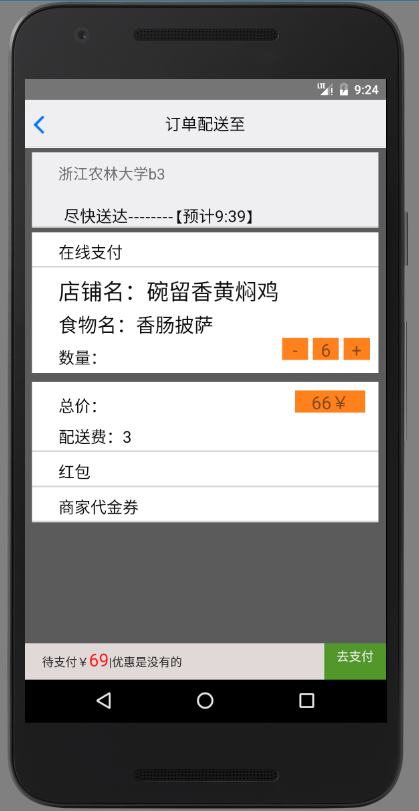
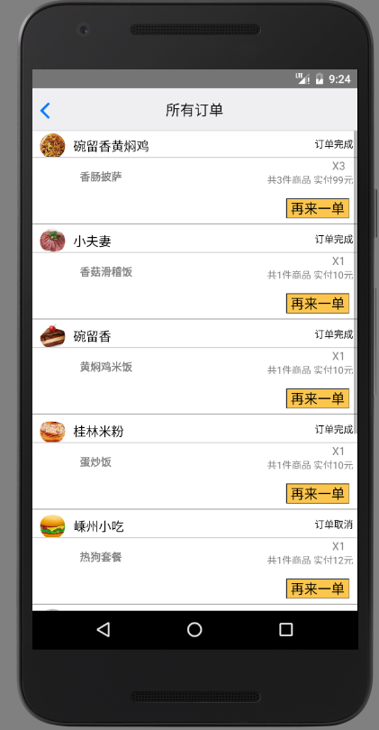
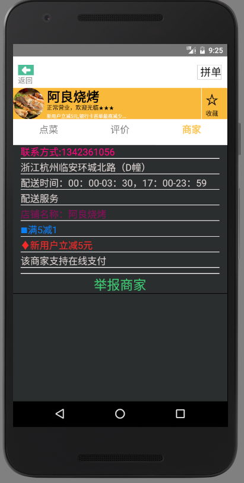

#   DUHAPP
##  基于React-native的仿美团外卖APP
### 使用技术&工具&第三方库
+   React，React-native框架
+   react-native-router-flux 页面切换，传值的第三方库
+   react-native-scrollable-tab-view 界面滑动切换第三方库
+   react-native-swiper 滑动切换第三方库
  

###    DEMO演示: <http://htmlpreview.github.io/?https://github.com/beastwinside/APP/blob/master/index.html> 

##  说明
####    本demo为本人学习React-native的第一个demo,参照REACT-NATIVE社区的“高仿美团rnapp”进行学习编写，准备作为这学期的安卓课程的课程设计。
####    原帖地址：http://bbs.reactnative.cn/topic/3742/%E9%AB%98%E4%BB%BF%E7%BE%8E%E5%9B%A2%E5%AE%A2%E6%88%B7%E7%AB%AF-react-native%E7%89%88-%E6%94%AF%E6%8C%81ios-android
####    因为没有mac，所以只做了安卓部分的真机测试，数据来自本地读取的json文件，并非从网络获取，按道理ios上运行也是没问题的。
####    由于本人也是react，react-native新手上路，在摸索着写这个app，以及之前的重构天猫超市的React DEMO中，积累了很多的坑，并把相应资料存在源代码目录文件夹中，方便同学react，react-native的同学参考，避开坑。
####    本demo不算上研究大神的rnapp的时间，从自己开始动手写到大致完成大概用了10天左右。目前可以说算入门了。编写过程中很多时间也是浪费在了寻找解决无意义的坑的地方。
####    因此准备在后续稍微空闲之后，把这个app与之前的重构天猫react app的源码上，加上注释，并整理一些踩坑集锦，来方便react，rn新手学习。大神的话就不要来吐槽了--

##  运行
####    1 确保在跑得了rn中文网test demo的情况下，fork我的demo到本地
####   2 在根目录命令行键入npm install来安装环境依赖（再次确认应该已经装了npm等）
####   3 连接安卓模拟器或者安卓真机，执行react-native run-android，如果是安卓真机通过usb连接，执行命令后请关闭node开的服务器。
####    4 打开meituan app即可见效果。

###       本人qq 1584824430，欢迎同起步的新人来骚扰一起成长，大神就免了
###       如果本demo对你学习有帮助，请给个star~

##---------6/4更新
#### 1。自己租了服务器，把数据扔到了腾讯云上，然后用fetch获取
#### 2。实现较为完整的下单过程,并在历史订单显示，再来一单等功能
#### 3. 首页添加商家搜索功能，优化购物车交互体验
#### 4. 优化色彩搭配，以及真机布局显示
#### 5. 历史订单实现下拉刷新数据

##6/8更新

####配色修改更贴近美团外卖，后台数据不再只是单纯的放到对象服务器
####找了个写php的小伙伴，让他提供了后台的数据接口。
####近期不再更新该app，近期计划是使用redux和react开发一个该app对应的商家版#####增添删改，登录注册功能的spa页面，同时找找丢失好久的感觉。
####待商家版web项目完成后，会继续添加该app与网络相关的登陆注册等功能
###最新截图

